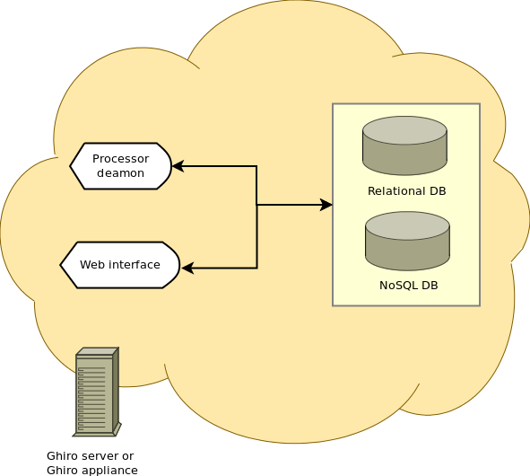

Why Ghiro?
==========

Sometime forensic investigators need to process digital images as evidence.
There are some tools around, most of them are little scripts, otherwise it is
difficult to deal with forensic analysis with many images involved.
Digital images contain tons of information, it is a thediuos work to manually
extract all of them, Ghiro extracts these information from provided images and
display them in a nicely formatted report.
Dealing  with tons of images has never been so easy, Ghiro is designed to scale 
to support gigs of images.
All tasks are totally automated, you have just to upload your images and let
Ghiro do the work.
Understandable reports and great search capabilities allows you to find a needle
in a haystack.
Ghiro is a multi user environment, different permissions can be assigned to each
user.
Cases allow you to group image analyses by topic, you can choose which user
allow to see your case with a permission schema. Every team in your forensic lab
could work in their own cases with priviledges separation.

Use Case
========

Ghiro can be used in many scenarios, forensic investigators could use it on
daily basis in their analysis lab but also people interested to undercover
secrets hidden in images could benefit.
Some use case examples are the following:

 * If you need to extract all data and metadata hidden in an image in a fully automated way
 * If you need to analyze a lot of images and you have not much time to read the report for all them
 * If you need to search a bunch of images for some metadata
 * If you need to geolocate a bunch of images and see them in a map
 * If you have an hash list of "special" images and you want to search for them

Anyway Ghiro is designed to be used in many other scenarios, the imagination is
the only limit.

Supported image types
=====================

The following file type are supported:

 * Windows bitmap .bmp
 * Raw Canon .cr2
 * Raw Canon .crw
 * Encapsulated PostScript .eps
 * Graphics Interchange Format .gif
 * JPEG File Interchange Format .jpg or .jpeg
 * Raw Minolta .mrw
 * Raw Olympus .orf
 * Portable Network Graphics .png
 * Raw Photoshop .psd
 * Raw Fujifilm .raf
 * Raw Panasonic .rw2
 * Raw TARGA .tga
 * Tagged Image File Format .tiff

Architecture
============

Ghiro is composed by the following components:

 * The web interface: to interact with all features, this is the component used by users to work with Ghiro
 * The processor deamon: it fetches waiting tasks from the queue, process and analyze images
 * The relation database: it stores relational data, you can choose between MySQL, PostgreSQL and SQLite3
 * The MongoDB database: it stores analysis data

Following the architecture in a simple schema:

Download Ghiro
==============

Ghiro can be downloaded from the `official website`_, where the stable and
packaged releases are distributed. Stable package is available in both
.zip and .tar.gz format.
The package above is strongly suggested for all users.
Some people need to keep updated with Ghiro's changes, they can download
(git clone) from our `official GitHub page`_.
There are two different releases available.

Development Branch
------------------

The development branch is where the next Ghiro's release is developed.
You can download Ghiro from here if you need to keep it always at the
cutting edge or if you want to hack on Ghiro.
You can download it with the following command::

    git clone https://github.com/ghirensics/ghiro.git

.. warning::
        While being more updated, the development branch should be
        considered an *under development*.
        Therefore its stability is not guaranteed.

.. _`official website`: http://www.getghiro.org
.. _`official GitHub page`: https://github.com/ghirensics/ghiro

Virtual Appliance
=================

The faster way to start playing with Ghiro is to download the Ghiro Virtual
Appliance.
You can download it from the `official website`_.
In few minutes you will have a fully functional Ghiro setup, running in a
virtual machine, to start to analyze your images.
It is an OVA file, you have to import in your virtualization software (like
VirtualBox or VMWare) and configure the networking as explained in the
documentation.

Getting Started
---------------

Import the .OVA file in your virtualization software (VirtualBox or Vmware).
For example in VirtualBox go in File > Import Appliance and select the .OVA file. 
Start the appliance.

The appliance credentials are:
Username: ghiro
Password: ghiromanager

For extra security, remember to change the password at your first access.

The first time you have to properly configure the network interface.
Select the virtual networking you like (for example
bridged or NAT); by default the appliance is configured in bridged mode.
By default, Ghiro appliance will get an IP address using DHCP and show it in
the boot screen.

If you need to manually configure your IP address: login in, and configure the
networking card with your desired IP, for example to
give the IP 192.168.0.10 use the following command:

sudo ifconfig eth0 192.168.0.10 up

When Ghiro apppliance has an IP address, via DHCP or via manual configuration,
the web interface is reachable on default HTTP port 80/tcp, just put the
appliance address in your browser. For example:

http://192.168.0.10 (or other DHCP or manually configured adress)

The web interface credentials are:
Username: ghiro
Password: ghiromanager

For extra security, remember to change the password at your first access.

Now you can start analyzing images! Go in the "Cases" panel, create your first
case, and add your images with the add button.
For usage help please refer to the documentation at:
http://www.getghiro.org/docs/latest/usage/index.html

If you need to access remotely to the appliance you can use SSH.
The appliance is shipped with a default disk of 50GB, if is not enough you can
create another virtual disk and add that to the root volume using LVM.

Appliance building
------------------

The appliance building script is open source and available under a project
dubbed `ghiro-appliance`_ on Github.

Ghiro appliance builder is a `packer.io`_ script to automagically create a Ghiro
appliance ready to be used, based on Ubuntu.

Using this script you should be able to create your onw Ghiro appliance updated
to Ghiro's developed branch. You can easily customize the appliance building
script to have your own customized appliance.

.. _`packer.io`: http://packer.io
.. _`ghiro-appliance`: https://github.com/ghirensics/ghiro-appliance
