Virtual Appliance
=================

The fastest way to start playing with Ghiro is to download the Ghiro Virtual
Appliance (it is a copy of Ubuntu Linux with all you need already installed, you
can run on your host) to help people get a running Ghiro in few steps.
In few minutes you will have a fully functional Ghiro setup, running in a
virtual machine, to start to analyze your images.
It is an OVA file, you have to import in your virtualization software (like
VirtualBox or VMWare) and configure the networking as explained in the
documentation.

Quick start guide
-----------------

The following steps will guide you through appliance setup.

Step 1. Ready for Virtualization
^^^^^^^^^^^^^^^^^^^^^^^^^^^^^^^^

You can run Ghiro Appliance in any host (Mac, Windows or Linux), only a
virtualization software is requested. There are many out there, free and
commercial, for example `Vmware`_ or `VirtualBox`_.

VirtualBox is a free and open source virtualization software, so for the sake
of this guide we are going to use it, although you can use any other software to
run Ghiro Appliance.

You need to have `VirtualBox`_ working, so download and install `VirtualBox`_
following the instruction on his website.

.. _`Vmware`: http://www.vmware.com/products/workstation
.. _`VirtualBox`: https://www.virtualbox.org/

Step 2. Get Ghiro Appliance
^^^^^^^^^^^^^^^^^^^^^^^^^^^

Download Ghiro Appliance from `Ghiro website`_ in OVA format and uncompress it,
it is around 600Mb (an image for Vmware ESXi is also available).

You will explode an .OVA file (the appliance), and a readme file with setup
instructions.

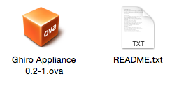

.. _`Ghiro website`: http://getghiro.org

Step 3. Import Appliance
^^^^^^^^^^^^^^^^^^^^^^^^

Now you can import the .OVA file inside VirtualBox.
Open VirtualBox, go in the menu File and click on “Import Appliance…”, a screen
like the following will popup:

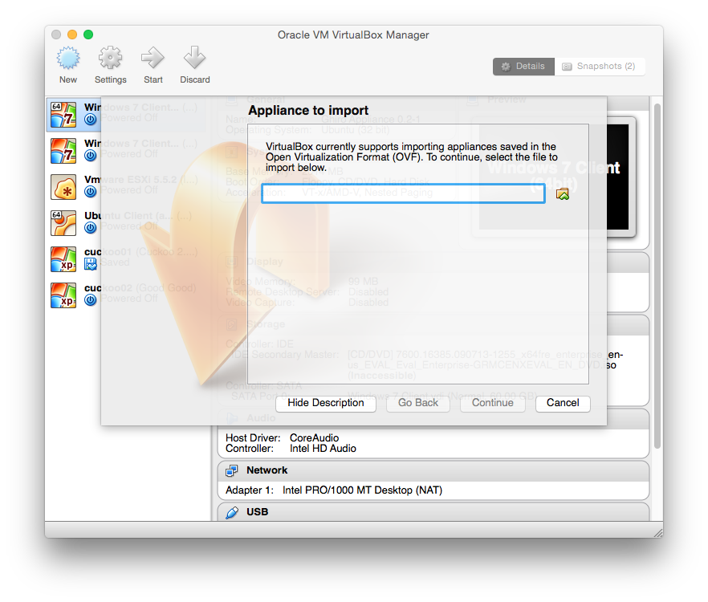

Select the .OVA file and than click “Continue”:

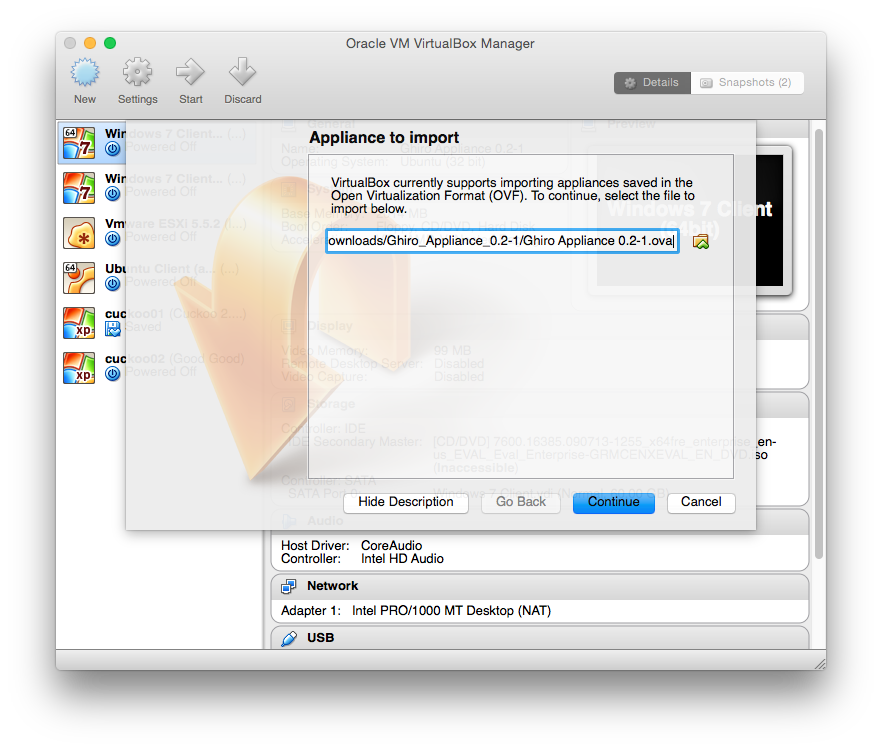

Now a default setting page is proposed, just hit “Import”:

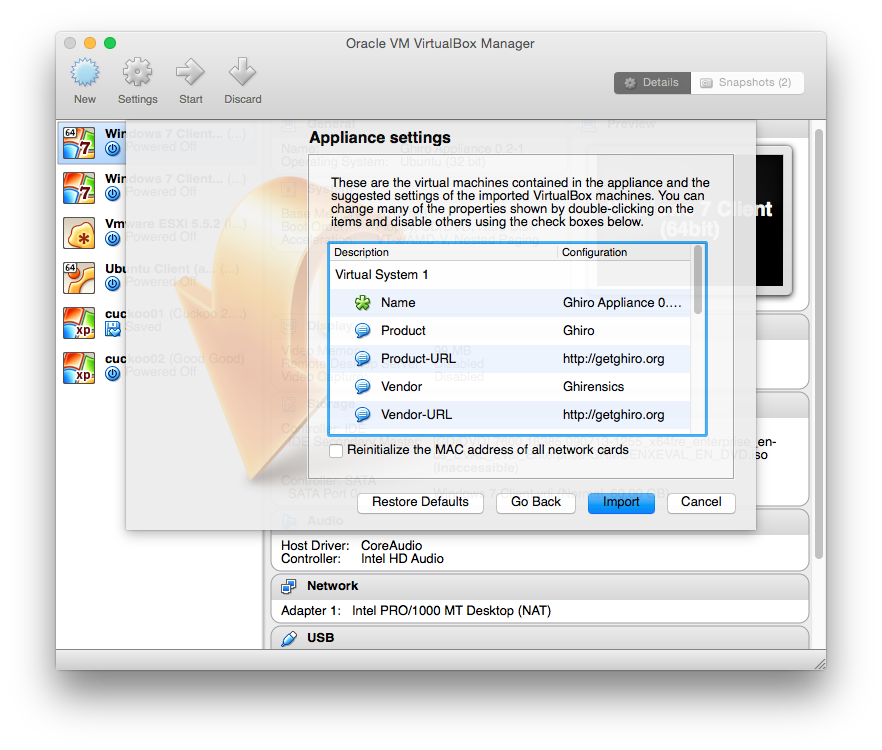

After clicking “Import” the import process will start and in a couple of minutes
it will be ready:

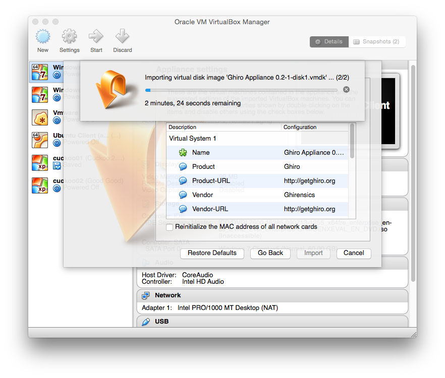

When the appliance is imported you will see it in virtual machines list
(don’t worry if you don’t have all the machines listed in the screenshots,
I am sorry but I have many):

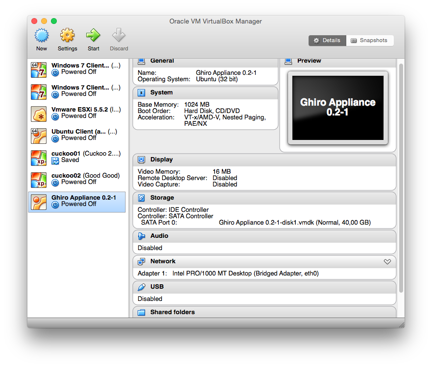

Step 4. Network Configuration
^^^^^^^^^^^^^^^^^^^^^^^^^^^^^

Most people fail configuring the network, so please pay attention.

Right click on your Ghiro Appliance on the Virtual Box Manager window and click
on "Settings".

Then choose the "Network" tab.

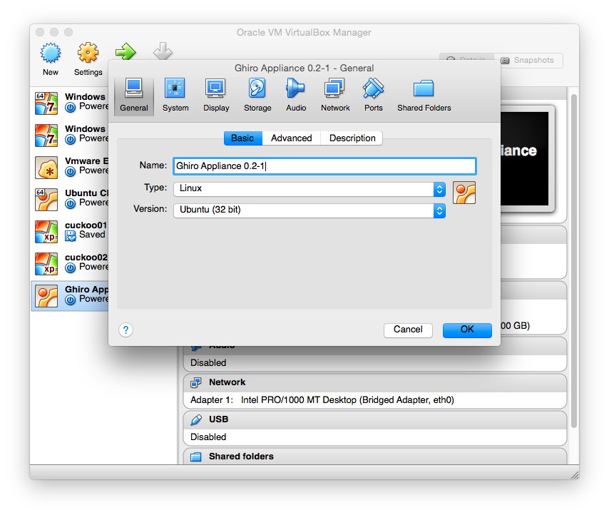

You have to configure how the virtual machine can connect to your network, so
now you are asked to select the network interface you are using and the type of
link (bridged or host only).

In most cases you need to set “Attached to:” to “Bridged Adapter” and you have
to set the “Name” of the network card you are using your for network, for
example if you are using your wired interface named “eth0”, select “eth0” on the
name drop down menu.

Remember to always set “Attached to:” to “Bridged Adapter” or “Host-only
Adapter”, never use NAT or any other option, it will not work due to how
networking is implemented in VirtualBox. For more information about connectivity
see the `VirtualBox documentation`_.

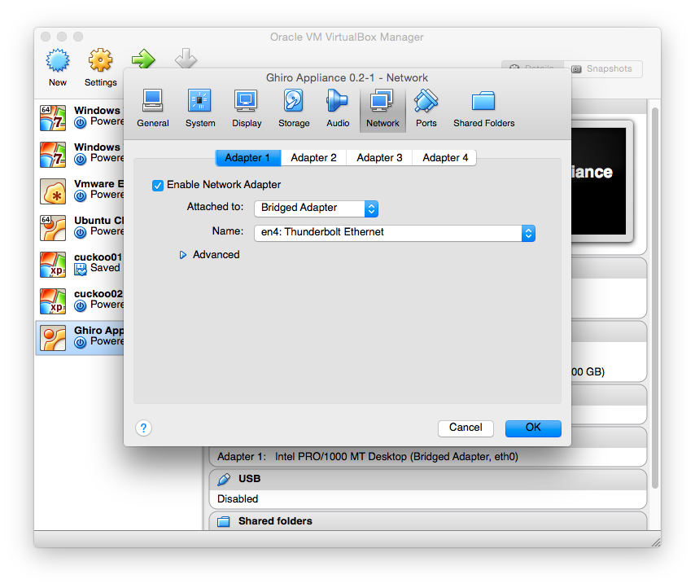

.. _`VirtualBox documentation`: https://www.virtualbox.org/manual/UserManual.html

Step 5. Start & Play
^^^^^^^^^^^^^^^^^^^^

Start the Ghiro Appliance selecting it and clicking on “Start”. The boot will
start, when the appliance is ready you will see a screen like this one.

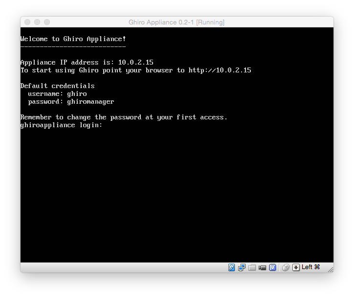

What you see is a Linux login screen, you have just to enter the credentials to
login.

Login as explained with:

 * Login: ghiro
 * Password: ghiromanager

Note that when you type the password it will not be shown.

If you login successfully you will see the command prompt, with the blinking
cursor after a “$” symbol.

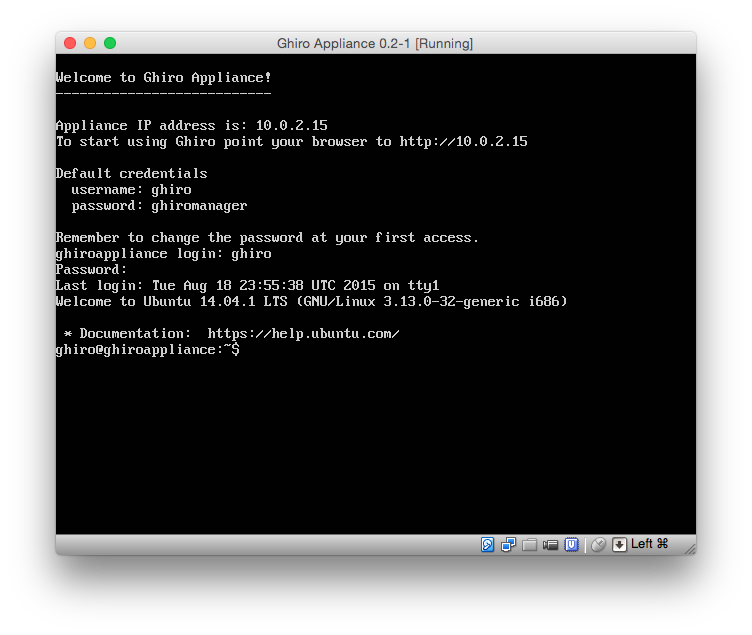

Now you must lookup your VirtualBox Appliance IP typing: ifconfig -a

On the line corresponding to “inet addr” for the interface “eth0” you will
have the Appliance IP address, highlighted in the picture below.

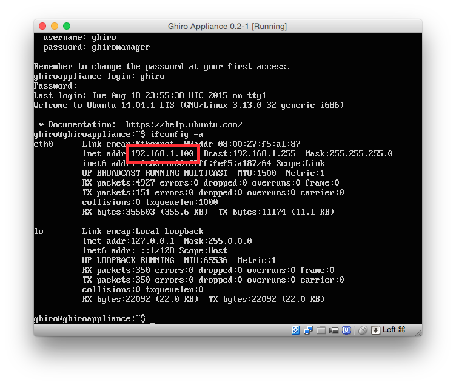

Now just put that address in your browser and the Ghiro interface will appear.

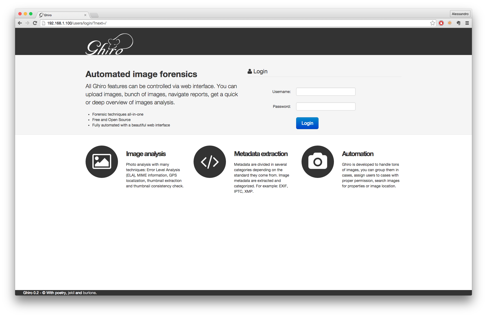

Now login in your browser with the same credentials and you will be ready to
play.

 * Login: ghiro
 * Password: ghiromanager

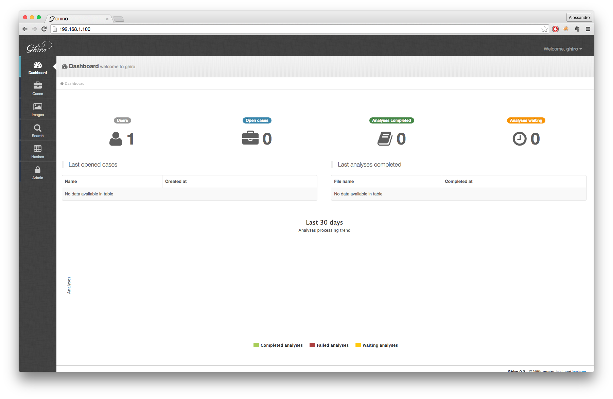

Now appliance is running, enjoy!
You can start analyzing images! Go in the "Cases" panel, create your first
case, and add your images with the add button.
For usage help please refer to the documentation at:
http://www.getghiro.org/docs/latest/usage/index.html

How to login
------------

What you see after Ghiro Appliance boot is a Linux login screen, you have just
to enter the credentials to login if you need to access the Appliance linux
OS.

Login as explained with:

 * Login: ghiro
 * Password: ghiromanager

Note that when you type the password it will not be shown.

If you login successfully you will see the command prompt, with the blinking
cursor after a “$” symbol.

Extra Configuration
-------------------

For extra security, remember to change the default password at your first access
for both web application and Linux console access.

If you need to manually configure your IP address: login in, and configure the
networking card with your desired IP, for example to
give the IP 192.168.0.10 use the following command::

sudo ifconfig eth0 192.168.0.10 up

If you need to access remotely to the appliance you can use SSH.
The appliance is shipped with a default disk of 50GB, if is not enough you can
create another virtual disk and add that to the root volume using LVM.

Appliance building
------------------

This chapter explains how Ghiro Appliance is created, probably you could skip
this if you are not interested in customizing the appliance.

The appliance building script is open source and available under a project
dubbed `ghiro-appliance`_ on Github.

Ghiro appliance builder is a `packer.io`_ script to automagically create a Ghiro
appliance ready to be used, based on Ubuntu.

Using this script you should be able to create your onw Ghiro appliance updated
to Ghiro's developed branch. You can easily customize the appliance building
script to have your own customized appliance.

.. _`packer.io`: http://packer.io
.. _`ghiro-appliance`: https://github.com/ghirensics/ghiro-appliance